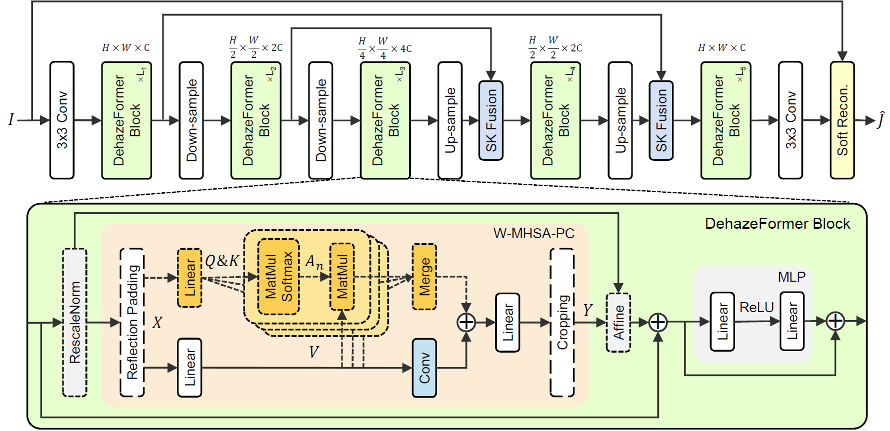

# Vision Transformers for Single Image Dehazing

[](https://huggingface.co/spaces/IDKiro/DehazeFormer_Demo)
[](https://doi.org/10.1109/TIP.2023.3256763) 
[](https://arxiv.org/abs/2204.03883) 
[](https://drive.google.com/drive/folders/1Yy_GH6_bydYPU6_JJzFQwig4LTh86VI4?usp=sharing)
[](https://pan.baidu.com/s/1R7cFISQHaWmFzq_7LyQMXQ?pwd=hab1)

> **Abstract:** 
Image dehazing is a representative low-level vision task that estimates latent haze-free images from hazy images.
In recent years, convolutional neural network-based methods have dominated image dehazing.
However, vision Transformers, which has recently made a breakthrough in high-level vision tasks, has not brought new dimensions to image dehazing.
We start with the popular Swin Transformer and find that several of its key designs are unsuitable for image dehazing.
To this end, we propose DehazeFormer, which consists of various improvements, such as the modified normalization layer, activation function, and spatial information aggregation scheme.
We train multiple variants of DehazeFormer on various datasets to demonstrate its effectiveness.
Specifically, on the most frequently used SOTS indoor set, our small model outperforms FFA-Net with only 25\% \#Param and 5\% computational cost.
To the best of our knowledge, our large model is the first method with the PSNR over 40 dB on the SOTS indoor set, dramatically outperforming the previous state-of-the-art methods.
We also collect a large-scale realistic remote sensing dehazing dataset for evaluating the method's capability to remove highly non-homogeneous haze.



## News

- **Mar 06, 2023:** Hugging Face [demo](https://huggingface.co/spaces/IDKiro/DehazeFormer_Demo) is updated. It is a [MCT](https://github.com/IDKiro/MCT) variant trained with a mixed dataset.
- **Feb 25, 2023:** Paper accepted by IEEE TIP. The [final version](https://doi.org/10.1109/TIP.2023.3256763) adds some experiments.
- **Sep 23, 2022:** We release [gUNet](https://github.com/IDKiro/gUNet) with better training code.
- **Apr 11, 2022:** [Arxiv paper link](https://arxiv.org/abs/2204.03883) is updated. [BaiduPan link](https://pan.baidu.com/s/1R7cFISQHaWmFzq_7LyQMXQ?pwd=hab1) is updated.
- **Apr 07, 2022:** Beta version is released, including codes, [pre-trained models](https://drive.google.com/drive/folders/1gnQiI_7Dvy-ZdQUVYXt7pW0EFQkpK39B?usp=sharing), and [RS-Haze-RGB](https://drive.google.com/drive/folders/1oaQSpdYHxEv-nMOB7yCLKfw2NDCJVtrx?usp=sharing).

## Preparation

### Install

We test the code on PyTorch 1.10.2 + CUDA 11.3 + cuDNN 8.2.0.

1. Create a new conda environment
```
conda create -n pt1102 python=3.7
conda activate pt1102
```

2. Install dependencies
```
conda install pytorch=1.10.2 torchvision torchaudio cudatoolkit=11.3 -c pytorch
pip install -r requirements.txt
```

### Download

You can download the pretrained models and datasets on [GoogleDrive](https://drive.google.com/drive/folders/1Yy_GH6_bydYPU6_JJzFQwig4LTh86VI4?usp=sharing) or [BaiduPan](https://pan.baidu.com/s/1WVdNccqDMnJ5k5Q__Y2dsg?pwd=gtuw) (gtuw).

Currently, we only provide gamma-corrected RGB images of our RS-Haze dataset.

The final file path should be the same as the following:

```
┬─ save_models
│   ├─ indoor
│   │   ├─ dehazeformer-b.pth
│   │   └─ ... (model name)
│   └─ ... (exp name)
└─ data
    ├─ RESIDE-IN
    │   ├─ train
    │   │   ├─ GT
    │   │   │   └─ ... (image filename)
    │   │   └─ hazy
    │   │       └─ ... (corresponds to the former)
    │   └─ test
    │       └─ ...
    └─ ... (dataset name)
```

## Training and Evaluation

In order to align the folder structure of each dataset, we rearrange the original dataset.

### Train

You can modify the training settings for each experiment in the `configs` folder.
Then run the following script to train the model:

```sh
python train.py --model (model name) --dataset (dataset name) --exp (exp name)
```

For example, we train the DehazeFormer-B on the ITS:

```sh
python train.py --model dehazeformer-b --dataset RESIDE-IN --exp indoor
```

[TensorBoard](https://pytorch.org/docs/1.10/tensorboard.html) will record the loss and evaluation performance during training.

### Test

Run the following script to test the trained model:

```sh
python test.py --model (model name) --dataset (dataset name) --exp (exp name)
```

For example, we test the DehazeFormer-B on the SOTS indoor set:

```sh
python test.py --model dehazeformer-b --dataset RESIDE-IN --exp indoor
```

Main test scripts can be found in `run.sh`.


## Notes

1. Send email to syd@zju.edu.cn if you have critical issues to be addressed.
2. Test results using opencv installed with conda are lower than pypi since they call different JPEG image codecs.
3. Because the synthetic dataset is not realistic enough, the trained models may not work well on real hazy images.
4. Refer to [two-branch](https://github.com/liuh127/NTIRE-2021-Dehazing-Two-branch) and modify the hyperparameters to train the model on real datasets.
5. Use the mixed dataset for training to obtain good dehazing results for real-world hazy images.
6. Get the code for the synthetic dataset method and MS images in [another repository](https://github.com/zhuqinghe/RS-Haze).


## Citation

If you find this work useful for your research, please cite our paper:

```bibtex
@article{song2023vision,
  title={Vision Transformers for Single Image Dehazing},
  author={Song, Yuda and He, Zhuqing and Qian, Hui and Du, Xin},
  journal={IEEE Transactions on Image Processing},
  year={2023},
  volume={32},
  pages={1927-1941}
}
```
